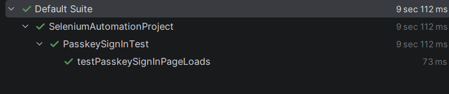

#Sovio Automation Suite

📖 Overview
This repository contains Selenium + TestNG automation tests for Sovio’s web application.
The suite validates critical authentication flows to ensure stability and usability.

🧪 Test Coverage
UserRegistrationTest → verifies the Sign‑Up page loads correctly.

SignInTest → verifies the Sign‑In page loads correctly.

PasskeyRegistrationTest → verifies the Passkey registration option is visible.

PasskeySignInTest → verifies the Passkey sign‑in option is visible.

📂 Project Structure
Code
SovioAutomation/
├── pom.xml
├── testng.xml
├── README.md
└── src/
    └── test/java/tests/
        ├── UserRegistrationTest.java
        ├── SignInTest.java
        ├── PasskeyRegistrationTest.java
        └── PasskeySignInTest.java
⚙️ Prerequisites
Java 11+

Maven 3.x

Chrome browser (latest)

IntelliJ IDEA or any Java IDE

Dependencies managed via Maven (pom.xml):

Selenium WebDriver

TestNG

WebDriverManager

🚀 Running Tests
Run All Tests
bash
mvn test
Or right‑click testng.xml in IntelliJ → Run Sovio Automation Suite.

Run Individual Test
bash
mvn -Dtest=tests.SignInTest test
✅ Expected Results
Pages load successfully:

Sign‑Up → "Create an account"

Sign‑In → "Sign in to your account"

Passkey flows → "Continue with email" / "Continue with passkey"

⚠️ Limitations:
Complex flows like email verification, QR scanning, and device setup are not automated.
Manual testing is required for external dependencies.

📸 Submission Evidence  
Include:

**Console output – UserRegistrationTest**  

**Console output – SignInTest**  

**Console output – PasskeyRegistrationTest**  

**Console output – PasskeySignInTest**  

 

👩‍💻 Author
Prepared for Sovio QA assignment  
Technologies: Selenium WebDriver, TestNG, Maven, WebDriverManager
